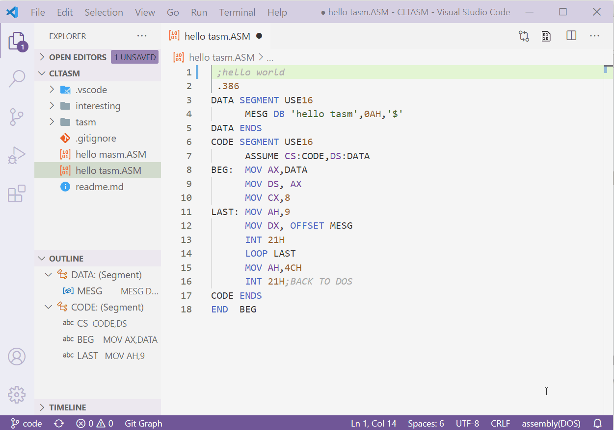
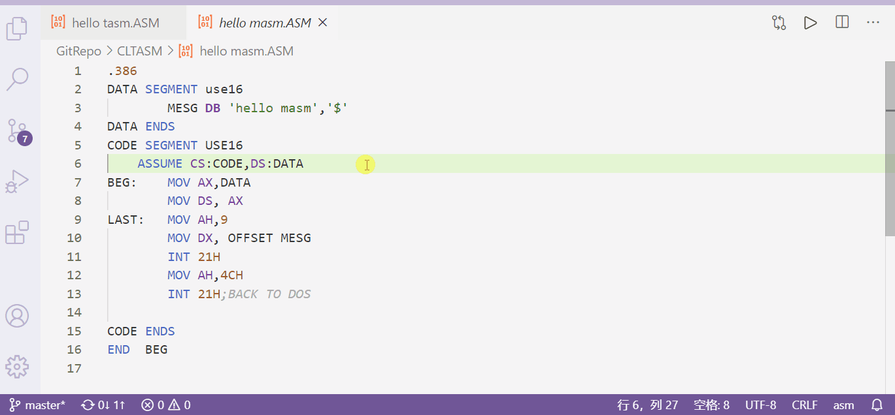
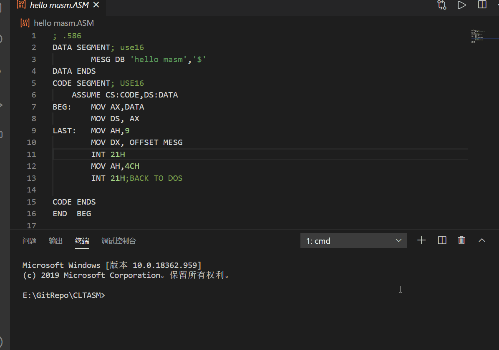
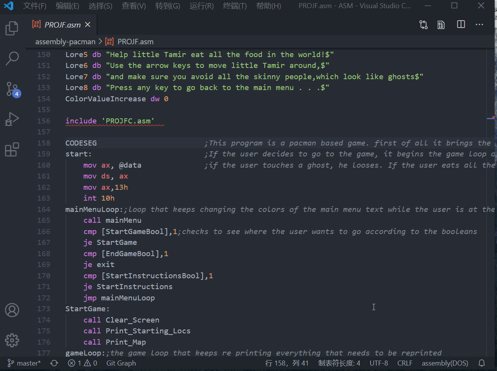
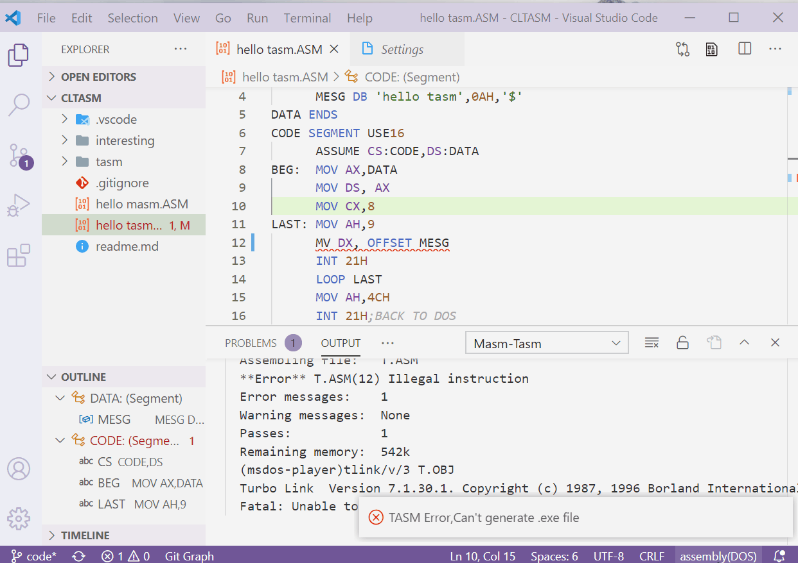

# DOS assembly (MASM/TASM) via DOSBox(and msdos-player)

[中文](doc/chs/README.md)|[English](README.md)|[more versions](https://github.com/xsro/masm-tasm/releases)

Language support for DOS assembly,may be suitable for studying MASM/TASM and the course *principles& peripheral technology of microprocessor*.

- (**Language Support**) Offer *grammar*,basic *outline* view,*hover*,*code formate* support for DOS assembly language
- **Run and debug** assembly with right click on the VSCode editor panel. You can choose using MASM or TASM in the preference-settings.
- **Diagnose**: process the output of ASM tools and display them in VSCode
- **For windows**, all needed tools have been packaged in the extension.Just install and enjoy!
- [For other systems](#for-other-system): you need to install DOSBox first
- Note: this extension is built for assembly in DOS, so may not works with assembly for wins

## Demo

### Demo 1: Run and Debug Assembly

| using TASM via DOSBox                          | using MASM via msdos-player                         |
| ---------------------------------------------- | --------------------------------------------------- |
|  |  |

when you are editing `assembly` files ,you can right click at the editor panel,then you will see several choices listed below:

1. **Open dosbox**: Open the dosbox, prepare the environment(copy file to dosbox's D:\ and add tools to path)
2. **Run ASM code**: Assemble,link and Run the program
3. **Debug ASM code**: Assemble,link and Debug the program

The extension will copy your file in active editor to the extension's `workspace` folder and do operations. Default is using `DOSBox` and `TASM`, you can change them in `preference->settings` like the second gif(using MASM via msdos-palyer).

### Demo 2: Open dosbox and type the command you need

| Single-File (command `Open DOSBox`)    | Multi-Files (command `Dosbox here`)                                              |
| -------------------------------------- | -------------------------------------------------------------------------------- |
|  | [](https://github.com/dpisdaniel/assembly-pacman) |

- Command "`Open DOSBox`": Your file will be copied as `D:\T.ASM` in DOSBox. (The extension will copy your file to work space and mount this space to DOSbox disk `D:`)
- Command "`Doxbox here`": The extension will mount your active editor file's folder directly to dosbox's disk `E:`.
- some ASM commands you may need: [ASM_commands](https://github.com/xsro/masm-tasm/wiki/ASM_commands).
- Some interesting assembly codes you may need: [DOSBox ASM codes](https://github.com/xsro/masm-tasm/wiki/dosbox)

### Demo 3: code Formate,Diagnose and more

| Formate Codes                                               | Diagnose                                 |
| ----------------------------------------------------------- | ---------------------------------------- |
|  |  |

The extension offer some programmatic features like "hover","formate","jump to definition",you can close them in the `preferece->settings`

## For other system

The extension is packaged with needed [tools](#about-tools) for windows inside while **other OS** users *should* make sure DOSBox can be opened by shell command.We can download DOSBox from its website:[DOSBox](https://www.dosbox.com)

For MacOS (Darwin),the extension will use command `open -a DOSBox --args` to open DOSBox. So you need to 

1. download dmg file from [DOSBox's website](https://www.dosbox.com)
2. Double-click the `.DMG` file to mount it. A new Finder window showing its contents should appear.
3. double-click the mounted volume on your desktop and drag the app icon from there to the “Applications” icon in the Finder sidebar.

For Ubuntu and other linux system user,The extension will use shell command `dosbox` to open DOSBox. We can use command like this:

```sh
sudo apt install dosbox  #install dosbox
dosbox #if successfully opened the dosbox, it is largely possible for the extension to use dosbox
```

You can also use the setting ID `masmtasm.dosbox.command` to set your command for the extension to open DOSBox.

## Extension Settings

for more,please see the `preference->settings`

- `masmtasm.ASM.MASMorTASM` use *MASM* or *TASM* assembler in DOS emulator to run and debug assembly
- `masmtasm.ASM.emulator` use dosbox or msdos-player as DOS emulator
  - `DOSBox` (default) more stable
  - `msdos-player`quiet, it runs in command prompt(CMD).  So it cannot support GUI like `TD.exe`
  - `auto` auto select
    1. use msdos-player to compile and link
    2. use DOSBox to run
    3. use msdos-player for MASM(debug)
    4. use DOSBox for TASM(TD)
- `masmtasm.ASM.savefirst`  save file first before using
- `masmtasm.dosbox.run`：what to do after run your code in DOSBox
- `masmtasm.dosbox.CustomResolution`: size(resolution) of the dosbox window,for example `1024x960`
- `"masmtasm.ASM.toolspath`: use tools from this path, see [Toolpath](doc/Toolspath.md)

### About use of DOSBox

The extension will mount some folder to DOSBox 's disk. Please don't modify them.

| in DOSBox | real path in the computor                                              |
| --------- | ---------------------------------------------------------------------- |
| C:        | the path of tools folder                                               |
| D:        | the path of the work space                                             |
| E:        | the path of the editor file's folder(when using command `dosbox here`) |

## Docs & Thanks & Licenses

- Thanks to [Roncho](https://marketplace.visualstudio.com/publishers/Roncho) 's extension [Assembly (TASM)](https://marketplace.visualstudio.com/items?itemName=Roncho.assembly-8086),[blindtiger](https://github.com/9176324)'s [masm](https://github.com/9176324/bltg-team.masm) for ASM language information
- Thanks to [Woodykaixa](https://github.com/Woodykaixa)'s [masm-code](https://github.com/Woodykaixa/masm-code)
- Using [msdos player](http://takeda-toshiya.my.coocan.jp/msdos),[dosbox](https://www.dosbox.com) as DOS environment emulator
- Welcome [issue](https://github.com/xsro/masm-tasm/issues) and PR to build a better extension with your help
- [some infomation :wiki](https://github.com/xsro/masm-tasm/wiki)

Enjoy!:smile:
