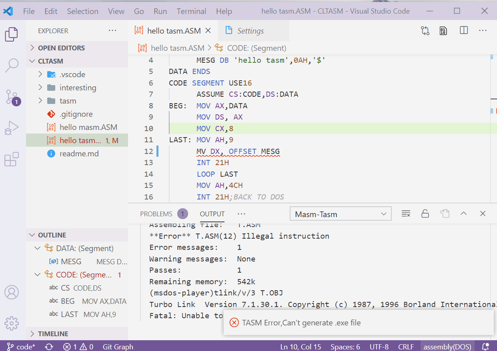
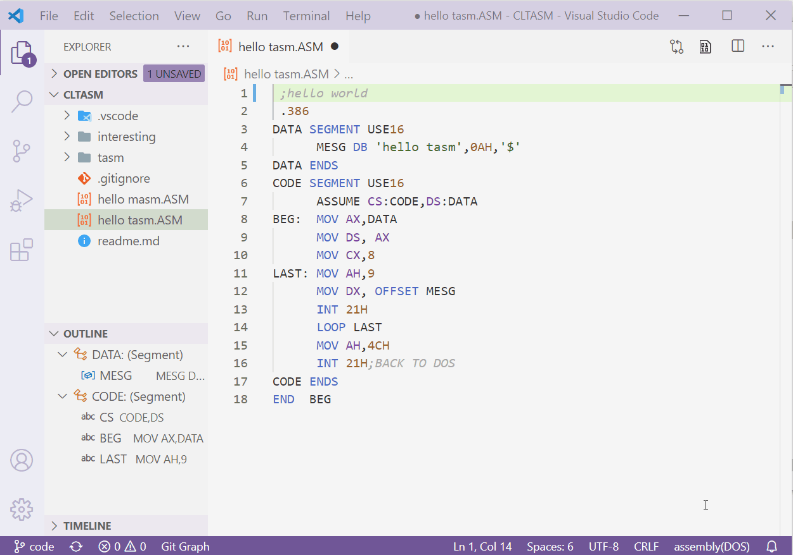
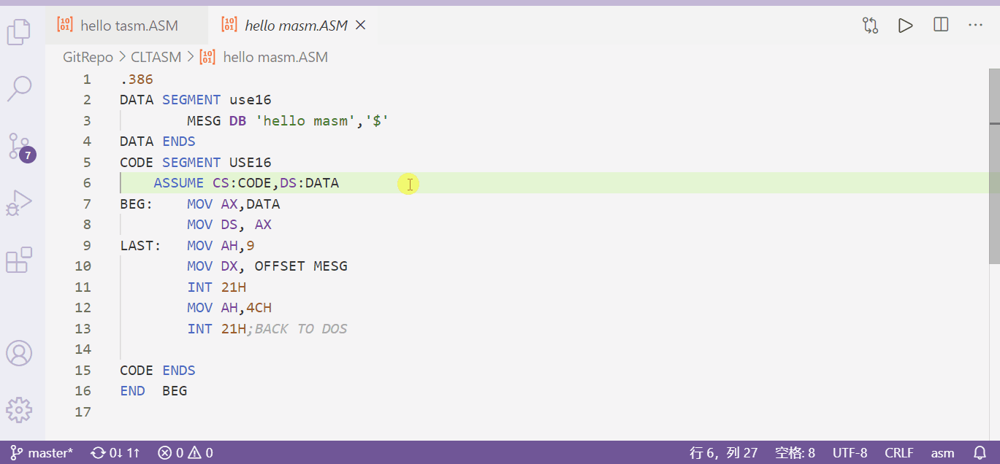

# Basic Support for MASM/TASM v2.x
[Chinese](README.zh.md) | [English](README.md)
[中文 in Gitee](https://gitee.com/dosasm/masm-tasm/)

Basic language support for assembly in **DOS** environment.
It may be suitable for studying MASM/TASM in DOSBox
or courses like *Principles and Peripheral Technology of Microprocessor*.

- **Language Support**: Offers *grammar* validation, basic *outline* view, *hover* tips, and *code formatting* support for DOS assembly language
- **Run and Debug**: Right-click on the VS Code editor panel to run and debug your code
- **Diagnose**: Processes the output of ASM tools and displays diagnostics in VS Code
- Supports all platforms including **Web** — see [Platform Support](#platform-support)
- Note: This extension is built for learning assembly in DOS, and it does not work with Win32 assembly

## Demo

### Demo 1: Language Features
| Format Code                  | Diagnose                         |
| ---------------------------- | -------------------------------- |
|  |  |

The extension provides language features such as hover hints, code formatting, and jump to definition for the `assembly` language ID.
You can also use other assembly language support extensions (e.g., the `asm-collection` language ID) by installing [ASM Code Lens](https://marketplace.visualstudio.com/items?itemName=maziac.asm-code-lens).

### Demo 2: Run and Debug
| Using TASM via DOSBox          | Using MASM via msdos-player   |
| ------------------------------ | ----------------------------- |
|  |  |

When editing `assembly` files, right-click in the editor panel to access the following options:
1. **Open Emulator**: Launch DOSBox and prepare the runtime environment
2. **Run ASM Code**: Assemble, link, and execute the program
3. **Debug ASM Code**: Assemble, link, and debug the program

#### Run/Debug Notes
- For single-file projects, set the configuration `masmtasm.ASM.mode` to `single file`. The extension will copy your file to an isolated directory to keep your workspace clean.
- For multi-file projects, set `masmtasm.ASM.mode` to `workspace` and ensure filenames comply with the emulator's limitations.
  - For example, when using `include <filename>`, `<filename>` should be a relative path from your workspace root directory
- Note that this extension is not optimized for complex projects

## Platform Support
This extension interfaces with the DOSBox(-X) binary via [Node.js's `child_process` module](https://nodejs.org/api/child_process.html).
You must install DOSBox or DOSBox-X first to use this feature.

Since VS Code is primarily built with JavaScript (TypeScript), we support the WebAssembly (Wasm) version of DOSBox(-X) — namely [js-dos](https://js-dos.com/overview.html).
The extension bundles all required js-dos files, and it uses js-dos as the default DOS emulator for Web platform support.

## Compiling to `.com` Files
You can customize the build commands by modifying the `masmtasm.ASM.actions` configuration.
For example, to compile your code to a `.com` file, add the following configuration and set `masmtasm.ASM.assembler` to its key (`TASM-com`):

```json
"masmtasm.ASM.actions": {
  "TASM-com": {
    "baseBundle": "<built-in>/TASM.jsdos",
    "before": [
      "PATH %PATH%;C:\\TASM"
    ],
    "run": [
      "TASM ${file}",
      "TLINK /t ${filename}",
      "${filename}"
    ],
    "debug": [
      "TASM /zi ${file}",
      "TLINK /t/v/3 ${filename}.obj",
      "TD ${filename}.exe"
    ]
  }
},
"masmtasm.ASM.assembler": "TASM-com"
```

## Docs & Acknowledgments & Licenses
- Special thanks to my teacher, *Mr. Han*. Wishing 2020 and the coming 2021 to be happy and fulfilling years.
- Inspired by [Woodykaixa](https://github.com/Woodykaixa)'s [masm-code](https://github.com/Woodykaixa/masm-code) project
- Thanks to the excellent DOS emulators: [DOSBox](https://www.dosbox.com), [caiiiycuk](https://github.com/caiiiycuk)'s [js-dos](https://js-dos.com/), and [msdos-player](http://takeda-toshiya.my.coocan.jp/msdos)
- Thanks to [Roncho](https://marketplace.visualstudio.com/publishers/Roncho)'s extension [Assembly (TASM)](https://marketplace.visualstudio.com/items?itemName=Roncho.assembly-8086) and [blindtiger](https://github.com/9176324)'s [masm](https://github.com/9176324/bltg-team.masm) for reference on assembly language support
- We welcome [issues](https://github.com/dosasm/masm-tasm/issues) and pull requests to help improve this extension
- [Acknowledgments](doc/Thanks.md)
- [Additional Information: Wiki](https://github.com/dosasm/masm-tasm/wiki)

Enjoy! 😊