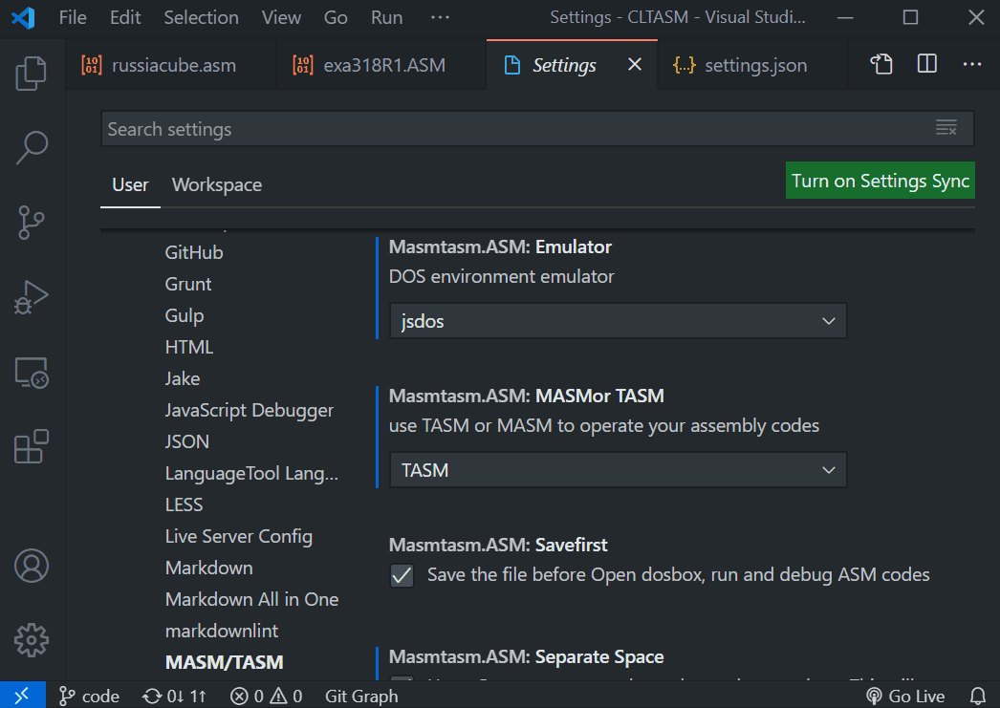
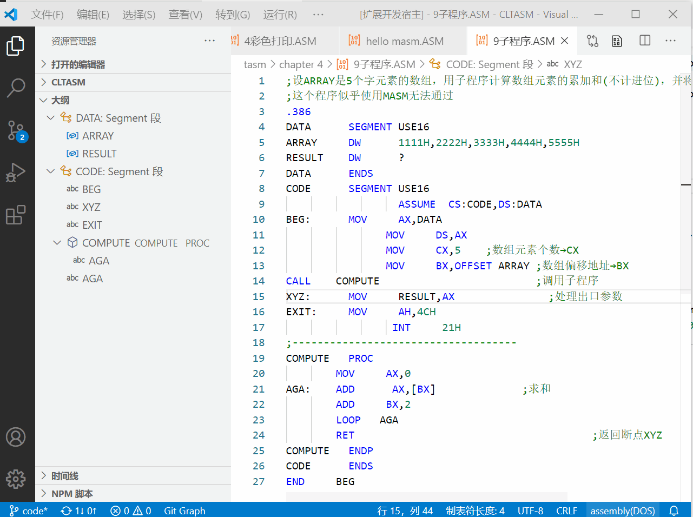
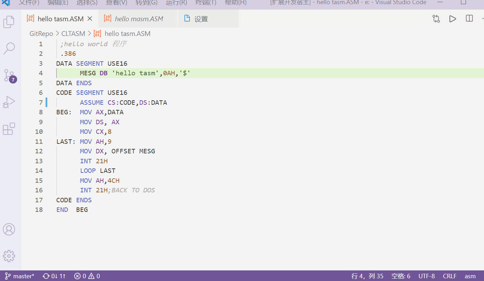

# 16 位/32 位 DOS 汇编语言支持

[中文](README.zh.md)|[English](README.md)

:raising_hand:实现对 DOSBox 等汇编工具的快速调用。主要针对 DOS 下的单文件汇编语言学习，可能适合学习《汇编语言》、《微机原理》等课程，主要功能特性如下：

- :bookmark_tabs:（**语法支持**）代码高亮，大纲信息，悬浮提示，代码格式化，错误信息标注功能
- :electric_plug:（**运行调试**）提供编辑器右键菜单选项：在汇编语言的编辑器添加了“打开 dosbox，运行，调试”的三个选项
- :bar_chart: 提供 diagnose**错误信息标注**功能：假如汇编未通过，会根据汇编器输出来标明错误信息与位置，可以在命令面板输入`清除MASM/TASM的所有问题信息`清除本插件输出的 diagnose 问题信息
- :computer: 支持包括 Web 在内的所有 VSCode 版本和平台，参见[平台支持](#平台支持)
- 注：该插件为学习 DOS 下的汇编语言开发，可能并不适合复杂的多文件汇编

## :rocket:DEMO 示例



### Demo 1 :flashlight: 代码格式化与错误输出

| 格式化代码                   | 错误信息输出                        |
| ---------------------------- | ----------------------------------- |
|  |  |

提供一些“编程语言特性”（悬浮提示，代码格式化，跳到定义，查看引用）来方便代码编写与阅读，如果不喜欢可以在设置`masmtasm.language.Hover`，`masmtasm.language.programmaticFeatures`中关闭，重启之后会生效。同时也可以使用其他插件提供的语言功能如[ASM Code Lens](https://marketplace.visualstudio.com/items?itemName=maziac.asm-code-lens) 提供的 language ID `asm-collection`

### Demo 2 :running:: 运行调试代码

| 调用 DOSBox 运行 TASM             | 调用 msdos-player 运行 MASM      |
| --------------------------------- | -------------------------------- |
|  |  |

当打开一个`ASM`后缀的汇编文件时，可以在编辑器右击，会出现以下三个选项：

1. 打开 DOS 环境：打开 DOSBox，然后就可以手动在打开的 DOSBox 窗口输入指令进行操作
2. 运行当前程序(汇编+链接+运行)：生成 exe 程序并运行
3. 调试当前程序(汇编+链接+调试)：生成 exe 程序并调试，使用 MASM 则会调用 debug 调试，使用 TASM 会调用 td 调试

#### 运行调试说明

- 如果所有汇编代码都存放在一个文件中，建议使用单文件模式将`masmtasm.ASM.mode`设置为`single file`，插件将会首先复制文件到插件的独立地址中，再进行操作。
- 如果代码非常复杂，建议设置`masmtasm.ASM.mode`为`workspace`，插件会直接挂载当前工作文件夹，可能会污染当天工作目录（对于 jsdos 会直接复制当前文件夹中的所有文件）。

## 平台支持

插件依赖[vscode-dosbox](https://marketplace.visualstudio.com/items?itemName=xsro.vscode-dosbox) 来与 DOS 模拟器交互。
`vscode-dosbox`打包了 win 平台上的二进制文件，参考[它的文档](https://github.com/dosasm/vscode-dosbox#dependency-installation) 在其他平台安装相关 DOS 模拟器。

## 自定义 Actions

可以通过设置`masmtasm.ASM.actions`来修改运行和调试的 DOS 命令。比如，需要编译成 COM 文件，可以添加如下设置。同时将`masmtasm.ASM.assembler`设置为 Action 的键`TASM-com`

```json
"masmtasm.ASM.actions": {
     "TASM-com": {
      "baseBundle": "<built-in>/TASM.jsdos",
      "before": [
        "set PATH=C:\\TASM"
      ],
      "run": [
        "TASM ${file}",
        "TLINK /t ${filename}",
        "${filename}"
      ],
      "debug": [
        "TASM /zi ${file}",
        "TLINK /t/v/3 ${filename}.obj",
        "TD ${filename}.exe"
      ]
    }
}
"masmtasm.ASM.assembler":"TASM-com"
```

## :cd:插件调用 dosbox 时会挂载哪些目录

| DOSBox | 电脑中的真实目录 |
| ------ | ---------------- |
| C:     | 汇编工具目录     |
| D:     | 插件汇编工作目录 |

### 编译成 COM 文件

### 插件安装路径一般在哪里

VSCode 文档中关于插件安装路径的说明[VSCode-doc](https://code.visualstudio.com/docs/editor/extension-gallery#_where-are-extensions-installed)，摘录如下

- Windows `%USERPROFILE%\.vscode\extensions`
- macOS `~/.vscode/extensions`
- Linux `~/.vscode/extensions`

### :clap:文档 & 感谢 & 许可

- 感谢南邮的《微型计算机原理与接口技术》课程
- 该插件受[Woodykaixa](https://github.com/Woodykaixa)的 [masm-code](https://github.com/Woodykaixa/masm-code)启发
- 插件通过[DOSBox](https://www.dosbox.com)、[caiiiycuk](https://github.com/caiiiycuk)的[JS DOS](https://js-dos.com/) 和[MSDOS player](http://takeda-toshiya.my.coocan.jp/msdos)模拟 DOS 环境
- 插件使用了[Roncho](https://marketplace.visualstudio.com/publishers/Roncho)的[Assembly (TASM)](https://marketplace.visualstudio.com/items?itemName=Roncho.assembly-8086)中的汇编语法信息
- 一些[相关信息](doc/license_and_info.md)和[鸣谢](doc/Thanks.md)
- gitee 上的一些笔记和代码: [笔记](https://dosasm.gitee.io/),[代码](https://gitee.com/dosasm/asmcodes)
- 一些相关资料：[wiki](https://github.com/dosasm/masm-tasm/wiki)
- 插件难免会有一些 bug，欢迎到 github 发[issue](https://github.com/dosasm/masm-tasm/issues)或者邮件`xsro@foxmail.com`，一起交流和完善。

Enjoy!:smile:
