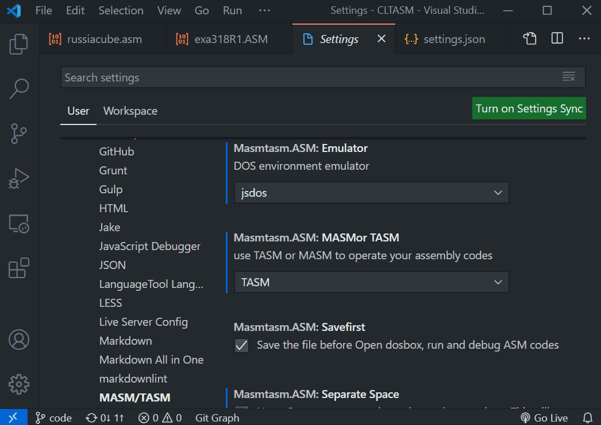
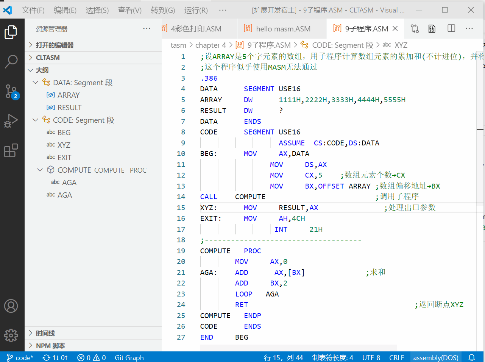
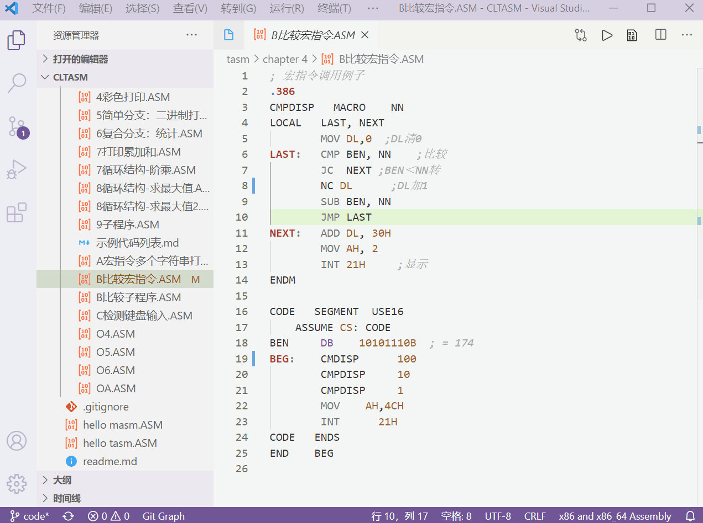
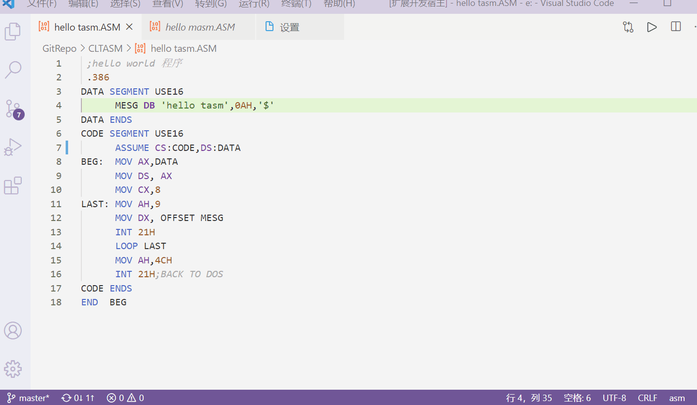

# 16 位/32 位 DOS 汇编语言支持

[中文](README.md)|[English](README.md)

:raising_hand:实现对 DOSBox 等汇编工具的快速调用。主要针对 DOS 下的单文件汇编语言学习，可能适合学习《汇编语言》、《微机原理》等课程，主要功能特性如下：

- :bookmark_tabs:（**语法支持**）代码高亮，大纲信息，悬浮提示，代码格式化，错误信息标注功能
- :electric_plug:（**运行调试**）提供编辑器右键菜单选项：在汇编语言编辑器中添加了“打开 DOSBox、运行、调试”三个选项
- :bar_chart: 提供 diagnose**错误信息标注**功能：如果汇编未通过，会根据汇编器输出标明错误信息与位置。可以在命令面板中输入`清除MASM/TASM的所有问题信息`来清除本插件输出的诊断问题信息
- :computer: 支持包括 Web 在内的所有 VSCode 版本和平台，参见[平台支持](#平台支持)
- 注：该插件为学习 DOS 下的汇编语言开发，可能并不适合复杂的多文件汇编项目

## :rocket:DEMO 示例



### Demo 1 :flashlight: 代码格式化与错误输出

| 格式化代码                   | 错误信息输出                        |
| ---------------------------- | ----------------------------------- |
|  |  |

提供一些“编程语言特性”（悬浮提示，代码格式化，跳到定义，查看引用）来方便代码编写与阅读。如果不喜欢，可以在设置中的`masmtasm.language.Hover`、`masmtasm.language.programmaticFeatures`中关闭，重启之后会生效。同时也可以使用其他插件提供的语言功能如[ASM Code Lens](https://marketplace.visualstudio.com/items?itemName=maziac.asm-code-lens) 提供的 language ID `asm-collection`

### Demo 2 :running:: 运行调试代码

| 调用 DOSBox 运行 TASM             | 调用 msdos-player 运行 MASM      |
| --------------------------------- | -------------------------------- |
|  |  |

当打开一个`ASM`后缀的汇编文件时，可以在编辑器右击，会出现以下三个选项：

1. 打开 DOS 环境：打开 DOSBox，然后就可以手动在打开的 DOSBox 窗口输入指令进行操作
2. 运行当前程序(汇编+链接+运行)：生成 exe 程序并运行
3. 调试当前程序(汇编+链接+调试)：生成 exe 程序并调试，使用 MASM 则会调用 debug 调试，使用 TASM 会调用 td 调试

#### 运行调试说明

- 插件会首先将文件复制到独立目录中，再进行操作，以保持工作区整洁。

#### 使用 `dosasm.jsonc` 进行项目配置

对于多文件项目或自定义构建流程，你可以在项目目录中放置 `dosasm.jsonc` 文件。当你右键点击 `.asm` 文件运行/调试时，扩展会从文件所在目录向上递归查找 `dosasm.jsonc`。如果找到，则使用其中定义的配置执行，而非默认设置。

示例 `dosasm.jsonc`：(参见 [multi file project sample](https://github.com/dosasm/masm-tasm/tree/v2/samples/multi)):
```jsonc
{
    "action": {
        "before": [
            "mount c ${<built-in>/TASM.jsdos}",
            "mount d ${actionFolder}",
            "PATH %PATH%;C:\\TASM",
            "d:",
            "cd d:\\"
        ],
        "open": [],
        "run": [
            "TASM ${file}",
            "TLINK ${filename}",
            ">${filename}"
        ],
        "debug": [
            "TASM /zi ${file}",
            "TLINK /v/3 ${filename}.obj",
            "copy C:\\TASM\\TDC2.TD TDCONFIG.TD",
            "TD -cTDCONFIG.TD ${filename}.exe"
        ]
    }
}
```

**模板变量：**
- `${file}` — 汇编文件在 DOS 中的完整路径
- `${filename}` — 不含扩展名的文件路径
- `${actionFolder}` — 包含 `dosasm.jsonc` 文件的目录
- `${<built-in>/TASM.jsdos}` — 解压后的 bundle 文件夹路径（扩展会自动解压 `.jsdos` 压缩包，并将解压后的文件夹作为该变量的值，以便挂载为 DOS 驱动器）

**工作原理：**
- `action.before` 命令用于设置 DOS 环境（挂载驱动器、设置 PATH 等）
- `action.run` 命令用于汇编、链接和执行程序
- `action.debug` 命令用于汇编、链接和启动调试器
- `action.open` 命令用于打开模拟器而不运行程序
- 当找到 `dosasm.jsonc` 时，默认的单文件挂载行为会被跳过——`before` 段完全控制环境设置
- **Bundle 解压**：`${<built-in>/TASM.jsdos}` 引用内置的 `.jsdos` 压缩包。扩展会自动解压该压缩包到一个文件夹，并将变量替换为该文件夹路径，以便挂载为 DOS 驱动器

## 平台支持

该扩展通过 [Node.js 的 `child_process` 模块](https://nodejs.org/api/child_process.html) 与 DOSBox(-X) 二进制程序进行交互。
若要使用此功能，你必须预先安装 DOSBox 或 DOSBox-X。

由于 VS Code 主要基于 JavaScript（TypeScript）构建，因此我们支持 DOSBox(-X) 的 WebAssembly（Wasm）版本——即 [js-dos](https://js-dos.com/overview.html)。
本扩展内置了运行 js-dos 所需的全部文件，并将其作为 Web 平台下的默认 DOS 模拟器。


## 自定义 Actions

可以通过修改`masmtasm.ASM.actions`设置来配置运行和调试的 DOS 命令。例如，需要编译成 COM 文件，可以添加如下设置，并将`masmtasm.ASM.assembler`的值设置为`TASM-com`

```json
"masmtasm.ASM.actions": {
     "TASM-com": {
      "baseBundle": "<built-in>/TASM.jsdos",
      "before": [
        "PATH %PATH%;C:\\TASM"
      ],
      "run": [
        "TASM ${file}",
        "TLINK /t ${filename}",
        "${filename}"
      ],
      "debug": [
        "TASM /zi ${file}",
        "TLINK /t/v/3 ${filename}.obj",
        "TD ${filename}.exe"
      ]
    }
}
"masmtasm.ASM.assembler":"TASM-com"
```

## :cd:插件调用 dosbox 时会挂载哪些目录

| DOSBox | 电脑中的真实目录 |
| ------ | ---------------- |
| C:     | 汇编工具目录     |
| D:     | 插件汇编工作目录 |

### 编译成 COM 文件

### 插件安装路径一般在哪里

VSCode 文档中关于插件安装路径的说明[VSCode-doc](https://code.visualstudio.com/docs/editor/extension-gallery#_where-are-extensions-installed)，摘录如下

- Windows `%USERPROFILE%\.vscode\extensions`
- macOS `~/.vscode/extensions`
- Linux `~/.vscode/extensions`

### :clap:文档 & 感谢 & 许可

- 感谢南邮的《微型计算机原理与接口技术》课程
- 该插件受[Woodykaixa](https://github.com/Woodykaixa)的 [masm-code](https://github.com/Woodykaixa/masm-code)启发
- 插件通过[DOSBox](https://www.dosbox.com)、[caiiiycuk](https://github.com/caiiiycuk)的[JS DOS](https://js-dos.com/) 和[MSDOS player](http://takeda-toshiya.my.coocan.jp/msdos)模拟 DOS 环境
- 插件使用了[Roncho](https://marketplace.visualstudio.com/publishers/Roncho)的[Assembly (TASM)](https://marketplace.visualstudio.com/items?itemName=Roncho.assembly-8086)中的汇编语法信息
- 一些[相关信息](doc/license_and_info.md)和[鸣谢](doc/Thanks.md)
- 一些相关资料：[wiki](https://github.com/dosasm/masm-tasm/wiki)
- 插件难免会有一些 bug，欢迎到 github 发[issue](https://github.com/dosasm/masm-tasm/issues)或者邮件`xsro@foxmail.com`，一起交流和完善。

Enjoy!:smile:
