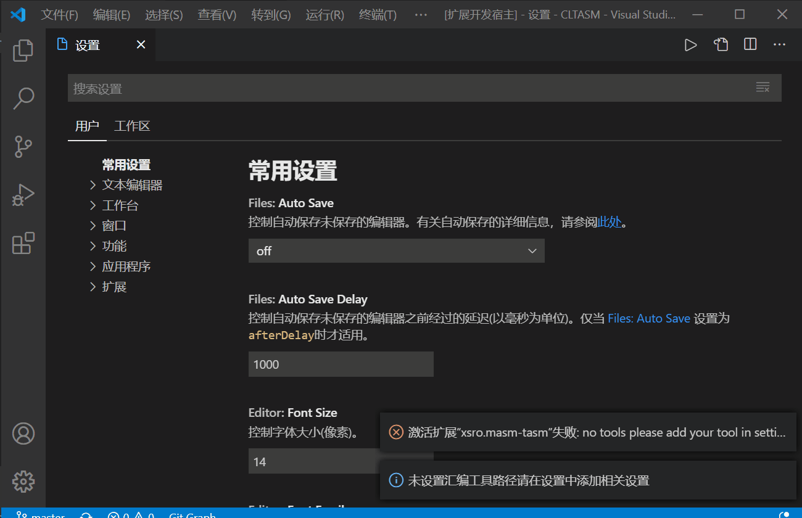

# 汇编工具相关信息

## 关于汇编工具

汇编工具在`masm-code`插件中选择的方式是，放置在[github release]中，然后使用typescript的require模块下载，但是我的汇编工具安排的文件目录比较复杂，直接下载可能会有许多问题，压缩后下载又必须要解压模块，而且稳定地下载源很难找到，所以我决定还是将相关工具与插件一起打包。这样就看vscode它自身的下载速度了哈。以下是我能想到的一些解决方案：

- 安装后下载，如插件downloadfile file，或者在代码中增加download模块或者require模块
- 与插件一起打包，大概会有2M左右应该也可以
- 不提供下载 用户自己下载，会比较麻烦

### 插件如何使用汇编工具的

插件会从用户获取它的用户工具的根目录，如果没有设置那么就是[插件安装目录](https://code.visualstudio.com/docs/editor/extension-gallery#_where-are-extensions-installed)下的tools文件夹，暂时我这个根目录用%tools表示，插件将下列位置寻找相关程序文件，同时由于这些软件都是外国的，对中文会不友好，插件会先将当前文件保存后，复制到%tools\work\T.ASM。由于td配置文件似乎有点奇怪，我也会复制一份tdconfig.td配置文件到这个work目录

- 到`%tools\dosbox`中寻找dosbox软件和简化dosbox运行过程的boxasm.bat
- 到`%tools\player`目录中寻找msdos player,和简化调用过程的asmo.bat
- 到`%tools\work`是零时文件存放的地方
- 到`%tools\tasm`中寻找TASM工具：tasm、tlink、td
- 到`%tools\masm`中寻找MASM工具:masm,link,debug

### 插件安装路径一般在哪里

- Windows `%USERPROFILE%\.vscode\extensions`
- macOS `~/.vscode/extensions`
- Linux `~/.vscode/extensions`

### 自带的汇编工具版本

16位环境模拟工具和汇编工具来自[github仓库](https://github.com/xsro/VSC-ASMtasks/releases),使用的是msdos的是MS-DOS Player (i486) for Win32 console，可以到[dosbox](https://dosbox.com)和[msdos player](http://takeda-toshiya.my.coocan.jp/msdos)下载使用其他版本的模拟器

|file|masm.exe|link.exe|debug.exe|tasm.exe|tlink.exe|td.exe|dosbox|msdos|
|---|----------|----------|----------|---------|----------|------|--------|--------|
|version|5.00|3.60|---|4.1|7.1.30.1|--|0.74|4/10/2020|

## 自定义汇编工具路径

(目前并不建议这么做）如果需要使用不同版本的软件，你可以用你的软件替换掉插件tools文件夹下的相关软件，当然你也可以自定义汇编工具路径。将文件路径复制到设置中即可。插件会从对应的文件夹中寻找相关组件

